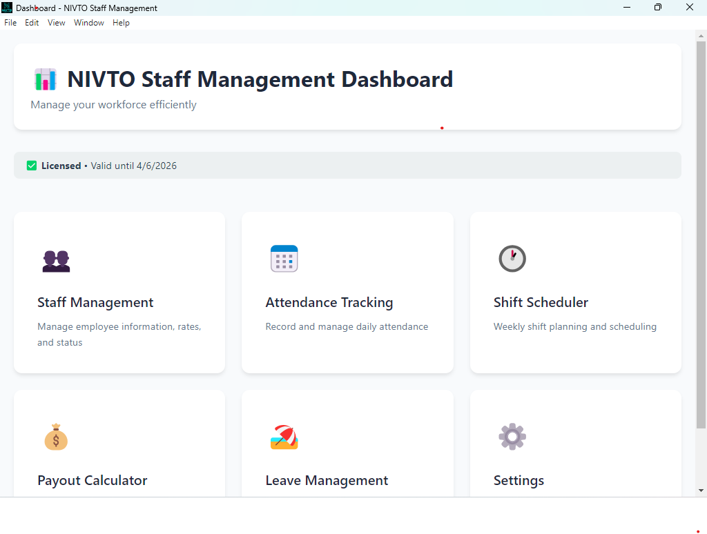

# NIVTO Staff Manager Website

Professional marketing website for NIVTO Staff Manager with download links for Windows and Android apps.

## 📁 Files Included

- `index.html` - Main website page
- `styles.css` - All styling and responsive design
- `script.js` - Interactive features and animations

## 🎨 Features

- **Responsive Design** - Works perfectly on desktop, tablet, and mobile
- **Modern UI** - Purple gradient theme matching your brand
- **Download Section** - Direct links to Windows installer and Android APK
- **Pricing Plans** - Monthly, Quarterly, and Annual options
- **Screenshots Section** - Placeholders for app screenshots
- **Smooth Animations** - Professional scroll effects
- **Call-to-Action** - Clear path to purchase/trial

## 📸 Adding Screenshots

1. Create an `images/` folder in the website directory
2. Take screenshots of your app (Dashboard, Staff, Attendance, Payroll pages)
3. Save them as:
   - `dashboard.png`
   - `staff.png`
   - `attendance.png`
   - `payroll.png`
4. Update `index.html` to replace placeholders:

```html
<!-- Replace the screenshot-placeholder divs with: -->

```

5. Add this CSS to `styles.css`:

```css
.screenshot-img {
    width: 100%;
    height: auto;
    border-radius: 15px;
    border: 3px solid var(--primary);
    box-shadow: 0 8px 30px rgba(0, 0, 0, 0.1);
}
```

## 🚀 Deployment Options

### Option 1: GitHub Pages (Free, Recommended)

1. **Create a GitHub repository:**
   ```bash
   cd c:\project\Staff_Management\StaffManager\website
   git init
   git add .
   git commit -m "Initial website commit"
   ```

2. **Push to GitHub:**
   ```bash
   git remote add origin https://github.com/YOUR_USERNAME/nivto-website.git
   git branch -M main
   git push -u origin main
   ```

3. **Enable GitHub Pages:**
   - Go to your repository settings
   - Navigate to "Pages" section
   - Select "main" branch as source
   - Your site will be live at: `https://YOUR_USERNAME.github.io/nivto-website/`

### Option 2: Netlify (Free, Easy)

1. **Install Netlify CLI:**
   ```bash
   npm install -g netlify-cli
   ```

2. **Deploy:**
   ```bash
   cd c:\project\Staff_Management\StaffManager\website
   netlify deploy --prod
   ```

3. **Follow the prompts:**
   - Create & configure a new site
   - Build command: (leave empty)
   - Publish directory: `.`
   - Your site will be live at: `https://YOUR-SITE-NAME.netlify.app`

### Option 3: Vercel (Free, Fast)

1. **Install Vercel CLI:**
   ```bash
   npm install -g vercel
   ```

2. **Deploy:**
   ```bash
   cd c:\project\Staff_Management\StaffManager\website
   vercel
   ```

3. **Follow the prompts:**
   - Set up and deploy
   - Your site will be live at: `https://YOUR-SITE-NAME.vercel.app`

### Option 4: Manual Hosting (Any Web Host)

1. Upload all files to your web hosting via FTP:
   - `index.html`
   - `styles.css`
   - `script.js`
   - `images/` folder (if you added screenshots)

2. Ensure the Windows installer and Android APK are accessible:
   - Upload to same hosting or cloud storage
   - Update download links in `index.html`

## 🔗 Update Links for Production

Before deploying, update these URLs in `index.html`:

1. **Payment Server URL** (replace `http://localhost:3000`):
   - Line 183: Pricing section buttons
   - Line 320: CTA button
   - Update to your live payment server URL

2. **Download Links** (if hosting elsewhere):
   - Line 257: Windows installer link
   - Line 268: Android APK link

## 📱 Custom Domain Setup

After deploying, you can add a custom domain (e.g., `www.nivto.co.za`):

**For GitHub Pages:**
1. Add a `CNAME` file with your domain
2. Configure DNS settings with your domain registrar

**For Netlify/Vercel:**
1. Go to domain settings in dashboard
2. Add your custom domain
3. Update DNS records as instructed

## 🔧 Configuration

### Payment Server URL

Update in `index.html` at these lines:
```html
<a href="YOUR_PAYMENT_SERVER_URL" class="btn btn-primary">Get Started</a>
```

### Download Links

Ensure paths are correct:
- Windows: `../dist/NIVTO Setup 1.0.0.exe`
- Android: `../NIVTOTimeClockApp/app/build/outputs/apk/debug/app-debug.apk`

Or upload to CDN/storage and update URLs.

## 📊 Analytics (Optional)

Add Google Analytics to track visitors:

1. Get your tracking ID from Google Analytics
2. Add before `</head>` in `index.html`:

```html
<!-- Google Analytics -->
<script async src="https://www.googletagmanager.com/gtag/js?id=YOUR_TRACKING_ID"></script>
<script>
  window.dataLayer = window.dataLayer || [];
  function gtag(){dataLayer.push(arguments);}
  gtag('js', new Date());
  gtag('config', 'YOUR_TRACKING_ID');
</script>
```

## 🎯 SEO Optimization

The website includes:
- ✅ Meta descriptions
- ✅ Semantic HTML
- ✅ Fast loading
- ✅ Mobile-responsive
- ✅ Clean URLs

To improve further:
1. Add Open Graph tags for social sharing
2. Create `sitemap.xml`
3. Add `robots.txt`
4. Submit to Google Search Console

## 📞 Support

Update contact information in the footer (lines 341-347) with your actual:
- Phone number
- Email address
- Support links

## 🛠️ Maintenance

To update the website:
1. Edit the HTML/CSS/JS files locally
2. Test in browser
3. Redeploy using your chosen method

## 📦 Bundled Apps

Make sure these files are accessible:
- Windows installer: `dist/NIVTO Setup 1.0.0.exe`
- Android APK: `NIVTOTimeClockApp/app/build/outputs/apk/debug/app-debug.apk`

## 🌐 Browser Support

Tested and working on:
- ✅ Chrome/Edge (latest)
- ✅ Firefox (latest)
- ✅ Safari (latest)
- ✅ Mobile browsers

---

**Website created for NIVTO Staff Manager**
© 2026 All rights reserved